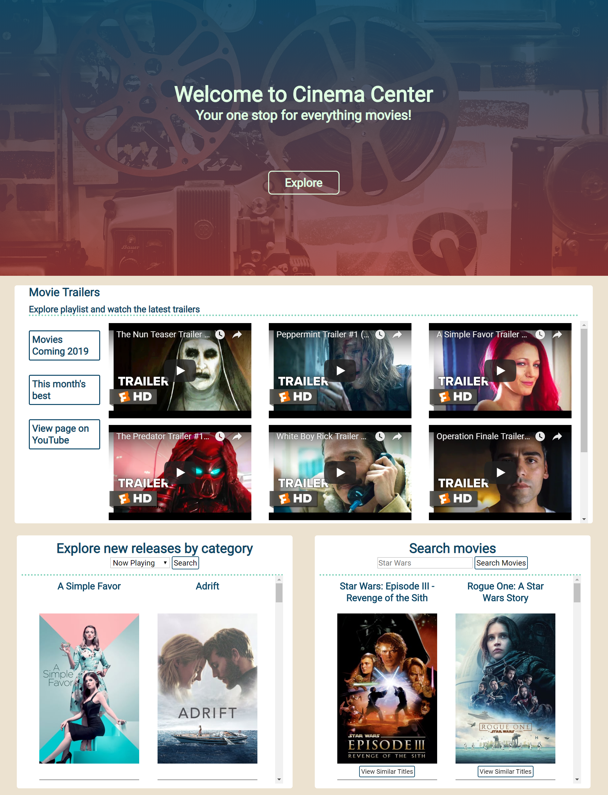

Cinema Center
=============
A single web page to watch the latest movie trailers, get information about new releases and find movie recommendations. 

Inspiration
-----------
I've spent countless amounts of time searching various resources to find information about the latest movies. "When is the release
date?" "How long is it?" "What's the viewer rating?" Cinema Center makes it easy for users to get all the information they need about
the latest movies.

Screenshots
-----------
### Desktop

#### Playlist search area

#### Explore new releases or search for your favorite movie

#### Click posters to get more information about the selected movie

### Mobile

Built with
----------
* HTML
* CSS
* JavaScript
* jQuery

Features
---------
* Watch movie trailers by playlist
* Explore new releases by category
* Search for movies
* Get information about selected movies
* Explore similar titles based on search results

Live Demo
---------
Demo: https://rjwilliams87.github.io/Cinema-Center/

Author
-------
Ryan J. Williams
